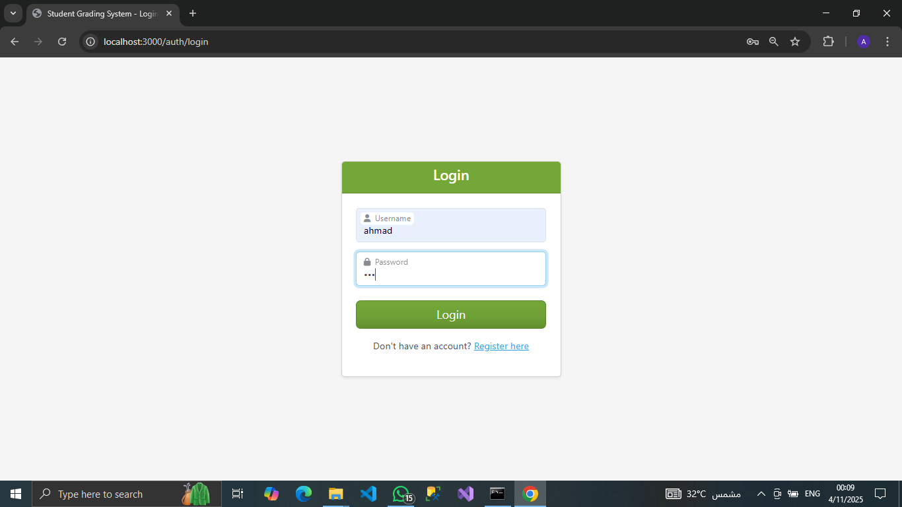
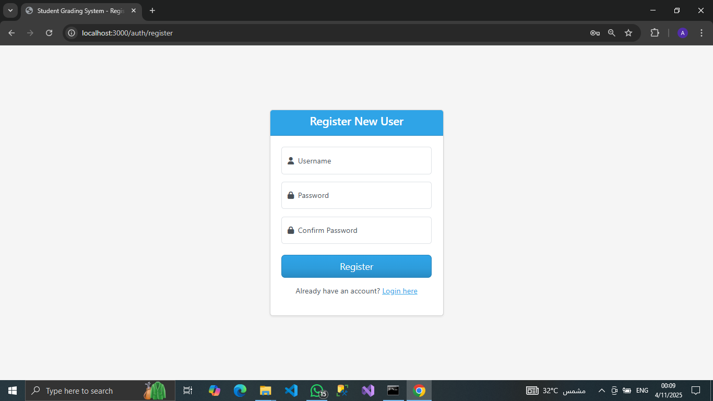
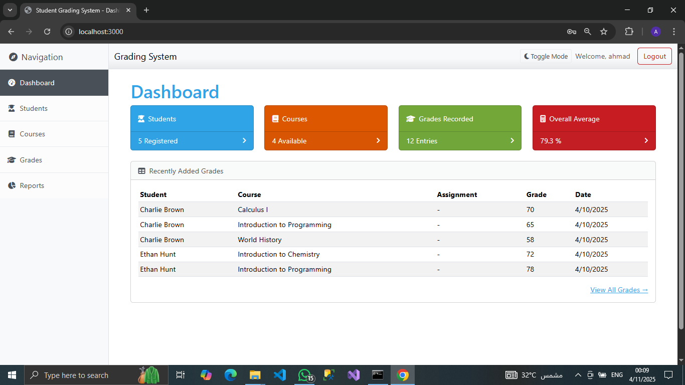
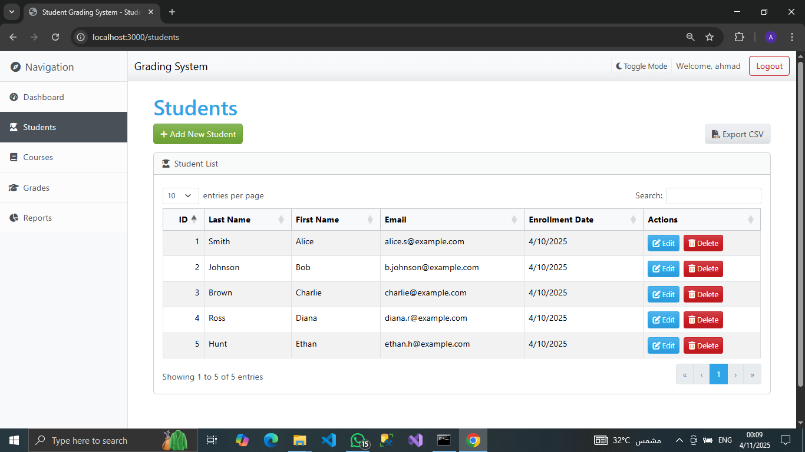
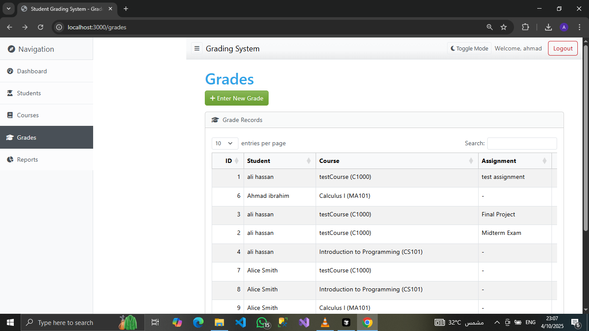
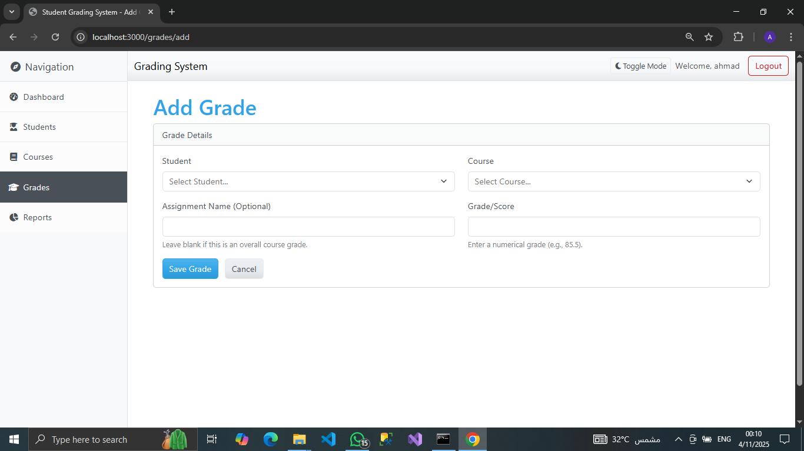
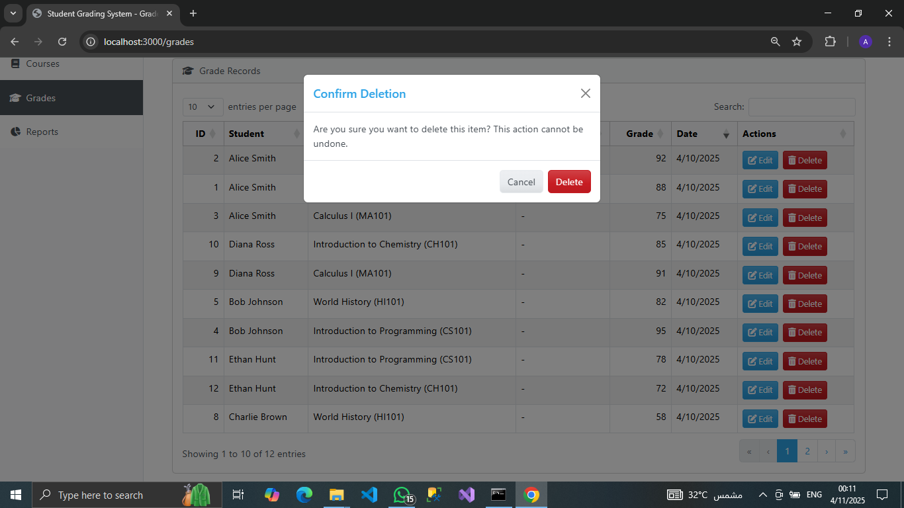
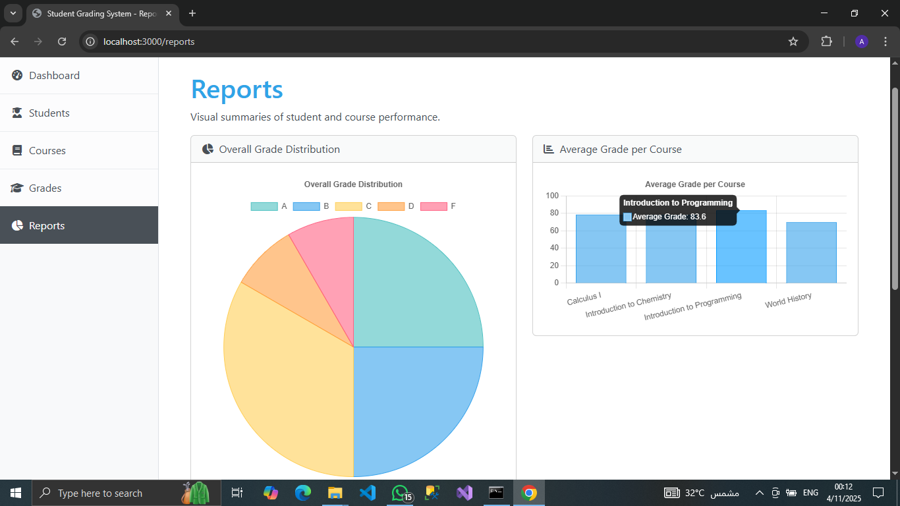
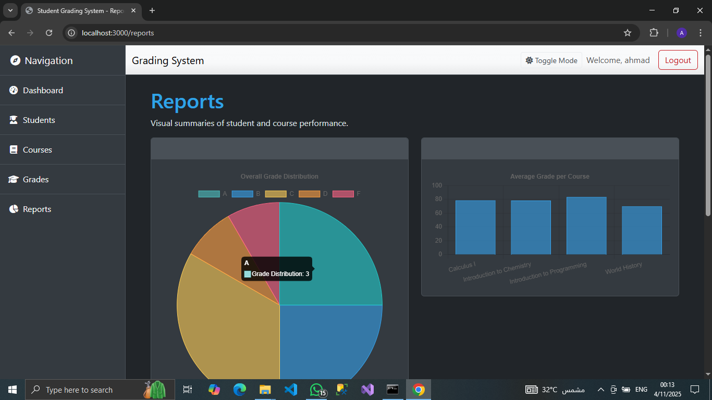

# Student Grading System


A web application for managing student records, courses, and grades, featuring a dashboard with reporting capabilities.


## Features

*   **Authentication:** Secure user registration and login.
*   **Dashboard:** Overview of key metrics (student count, course count, grade count, overall average) and recent grade entries.
*   **Student Management:** CRUD (Create, Read, Update, Delete) operations for student records.
*   **Course Management:** CRUD operations for course records.
*   **Grade Management:** CRUD operations for grade entries, linking students and courses.
*   **Reporting:** 
    *   Visual charts (Grade Distribution Pie Chart, Average Grade per Course Bar Chart).
    *   Student Performance Overview table (average grade, courses count).
*   **UI Enhancements:**
    *   Themed interface using Bootswatch ("Cerulean").
    *   Dark Mode toggle with persistence via `localStorage`.
    *   Enhanced data tables (Search, Sort, Pagination) using DataTables.js for Students, Courses, Grades, and Student Performance Overview.
    *   Searchable dropdowns (Tom Select) for student/course selection in the Grade form.
    *   Client-side form validation (Bootstrap).
    *   Improved delete confirmations using Bootstrap Modals.
    *   User-friendly date picker (flatpickr) for Date of Birth.
    *   Flash messages for user feedback on actions.
    *   Icons (Font Awesome) used throughout the interface.
    *   Sidebar navigation highlighting the active page.
*   **Data Export:** Export Student and Course lists to CSV format.

## Tech Stack

*   **Backend:** Node.js, Express.js
*   **Database:** SQLite (using `sqlite3` driver)
*   **Templating:** EJS (Embedded JavaScript templates) with `express-ejs-layouts`
*   **Frontend Framework:** Bootstrap 5 (via Bootswatch "Cerulean" theme)
*   **Session Management:** `express-session`, `connect-sqlite3`
*   **Password Hashing:** `bcrypt`
*   **Frontend Libraries:**
    *   jQuery (Dependency for DataTables)
    *   DataTables.js (for enhanced HTML tables)
    *   Chart.js (for dashboard/report charts)
    *   Tom Select (for searchable dropdowns)
    *   flatpickr (for date picker)
    *   Font Awesome (for icons)
*   **Development:** `nodemon` (auto-reload), `dotenv` (environment variables)
*   **Utilities:** `async`, `json2csv` (for CSV export), `connect-flash` (flash messages)

## Setup and Installation

1.  **Clone the repository:**
    ```bash
    git clone https://github.com/MasterWithAhmad/Student-Grading-System.git

    cd student-grading-system
    ```
2.  **Install dependencies:**
    ```bash
    npm install
    ```
3.  **Environment Variables:**
    *   Create a `.env` file in the project root.
    *   Add a secret key for session encryption:
        ```
        SESSION_SECRET='your_strong_random_session_secret_here'
        ```
        Replace `'your_strong_random_session_secret_here'` with a long, random string.

## Running the Application

1.  **Seed the Database (Optional but Recommended for Demo):**
    *   This script populates the database with sample students, courses, and grades.
    *   **Note:** Running the seed script multiple times might create duplicate entries unless you uncomment the `DELETE` statements within `seed.js`. Be careful if uncommenting `DELETE FROM users`.
    ```bash
    npm run seed 
    ```

2.  **Run in Development Mode:**
    *   Uses `nodemon` for automatic server restarts on file changes.
    ```bash
    npm run dev
    ```
    The application will be available at `http://localhost:3000` (or the port specified by `process.env.PORT`).

3.  **Run in Production Mode:**
    ```bash
    npm start
    ```

## Screenshots

*   Login Page:
    

*   Register Page:
    

*   Dashboard:
    

*   Student List:
    


*   Grade List:
    

*   Add/Edit Grade Form:
    

*   Delete Confirmation Modal:
    

*   Reports Page:
    

*   Dark Mode Example:
     

## Contributing

Contributions are welcome! Please feel free to submit a pull request or open an issue to report bugs or suggest features.


## License


This project is licensed under the **MIT** License. See the [LICENSE](LICENSE) file for details. 